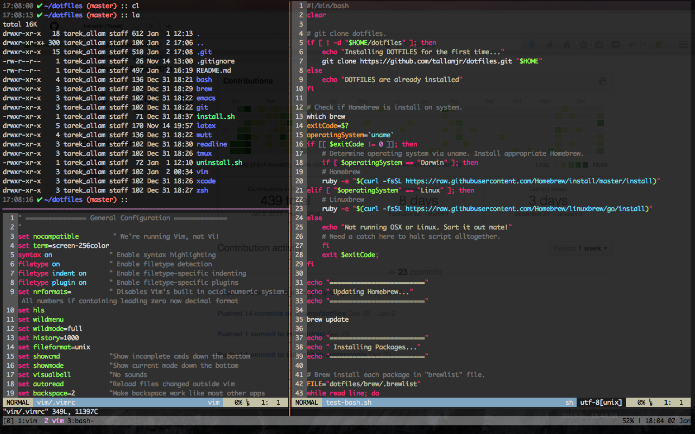

# DOTFILES

| `master`  | `develop` |
| ------------- | ------------- |
| [](https://travis-ci.com/tallamjr/dotfiles) | [](https://travis-ci.com/tallamjr/dotfiles) |


## Installation

See my blog post for an overview of my dotfile story.

### Clean System Install

To provision a new machine, just run:

```bash
bash -c "`curl -fsSL https://raw.githubusercontent.com/tallamjr/dotfiles/master/provisionANSI.sh`"
```

This will run a [*bootstrap*](https://github.com/tallamjr/dotfiles/blob/master/provisionANSI.sh)
script to determine the operating system that is running, and then either install [Homebrew](https://brew.sh/)
or [Linuxbrew](http://linuxbrew.sh/).

After the respective package manager is
installed, it will then install [Ansible](https://www.ansible.com/) which
handles the rest of the provisioning, utilising the
[*playbook*](https://github.com/tallamjr/dotfiles/tree/master/playbook).

The playbook handles installation of all desired brew packages (homebrew) and applications
(homebrew-cask). It also, with the use of GNU Stow, symlinks all configuration
files a.k.a *dotfiles* to `$HOME` directory.

One may prefer to provision a machine without using Ansible and stick to good
old UNIX commands only. To do so, run the command below:

```bash
bash -c "`curl -fsSL https://raw.githubusercontent.com/tallamjr/dotfiles/master/provisionNIX.sh`"
```

### Temporary Configuration Install

If only temporarily installing on another machine, run:

```bash
bash -c "`curl -fsSL https://rawgit.com/tallamjr/dotfiles/master/temp-install.sh`"
```

This is certainly a much simpler task than provisioning a new machine. This
script clones this repo and symlinks the relevant configuration files.

Uninstalling, however, was definitely not as simple as hoped. Nonetheless, when
finished, one can run `./uninstall.sh` from the dotfile directory itself to
remove all settings.

**WARNING!**

Install and uninstall scripts have been tested but not extensively, please use
with caution. Inspect files first!

*NOTE* : This repo is a work in progress and subject
to change. In it's current form, it has drawn inspiration from these sources:

* Some repo
* Some repo
* Some repo

... and more.

## Screenshot



